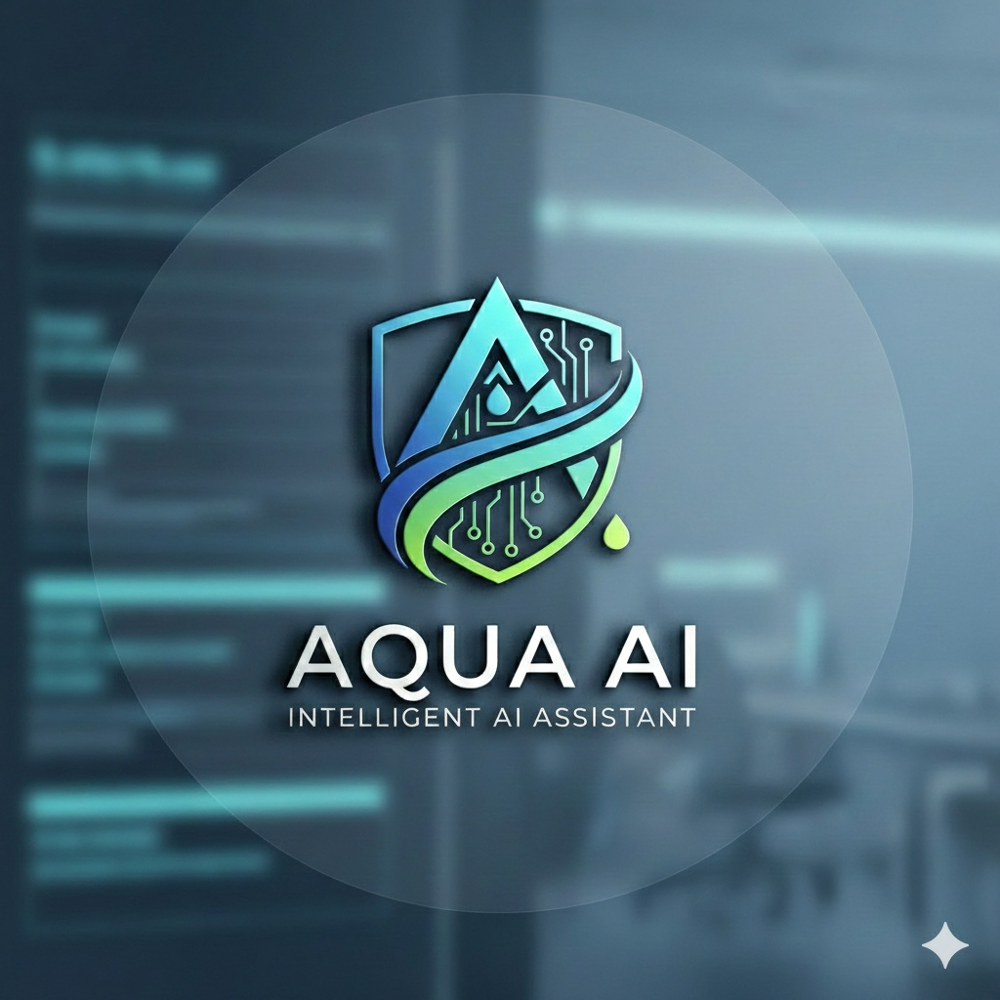

<p align="center">
  
</p>

<h1 align="center">Aqua DB Copilot</h1>
<h3 align="center">Your Intelligent Database Engineering Partner</h3>

<p align="center">
  <strong>AI-Powered Database Engineering Platform for Enterprise Teams</strong>
</p>

<p align="center">
  
  
  
  
  
  
</p>

---

## Overview

**Aqua DB Copilot** is an enterprise-grade AI Database Engineering Platform designed for teams working on large-scale systems such as banking, payment processing, and card management platforms. It assists developers and architects in designing databases, visualizing schemas, optimizing queries, managing data lifecycle, and planning database migrations — all powered by AI.

The platform supports databases containing **millions to billions of records** and operates under a **Project Workspace model** where all features are project-centric.

---

## Key Features

### Module 1 — Project Workspace
- Create and manage database projects
- Support for **Existing Database Projects** (upload SQL/DDL files) and **New Database Design Projects** (AI-assisted)
- Automatic SQL parsing, schema extraction, and ER diagram generation
- Multi-database engine support

### Module 2 — Schema Intelligence
- **Interactive ER Diagram Generator** with drag-and-drop (React Flow + Dagre layout)
- **Table Dependency Graph** showing FK relationships and parent-child hierarchy
- **Database Knowledge Graph** (Table → Columns → Queries → Reports → APIs)
- **Schema Change Impact Analyzer** — detect affected queries, stored procedures, and views
- **Automatic Database Documentation** export (HTML, PDF, Markdown)
- Schema snapshot versioning and comparison

### Module 3 — Query Intelligence
- **AI-Powered SQL Editor** with syntax highlighting
- **Query Analyzer** with EXPLAIN ANALYZE visualization
- **Query Cost Prediction** before execution
- **Automatic Query Rewrite AI** — optimize inefficient queries
- **Natural Language to SQL** — describe what you want, get SQL
- **Index Optimization Advisor** — AI-recommended indexes
- **Partition Recommendation Engine**
- **ORM Performance Analyzer** (JPA/Hibernate) — detect N+1 queries
- **DB Reviewer Agent** — detect anti-patterns (SELECT *, missing indexes, large table scans)
- **Database Incident Investigation AI** — root cause analysis from slow query logs

### Module 4 — Performance Lab
- **Synthetic Data Generator** — generate 1M to 100M rows with referential integrity
- **Query Performance Benchmark Engine**
- **Performance Comparison** — no index vs. with index vs. with partition

### Module 5 — Data Lifecycle Management
- **Data Purging Strategy Engine** — analyze table size, row age, data growth
- **Retention Policy Management** — configurable rules per table
- **Purge Script Generator** — safe batch deletes
- **Purge Scheduler** — generate cron, Kubernetes, and Airflow jobs

### Module 6 — Migration Studio
- **Cross-Database Script Migration Engine** — PostgreSQL, MySQL, Oracle, SQL Server, MariaDB, Snowflake, BigQuery, MongoDB
- **Dialect Conversion** — automatic data type, index, trigger, constraint translation
- **Schema Comparison** — source vs. target mismatch detection
- **Migration Validation** — row count, checksum, sample data verification

### Security & Compliance
- Role-Based Access Control (RBAC)
- Audit logging with AES-256-GCM encryption
- PCI DSS and GDPR compliance support

---

## Supported Databases

| Database | Status |
|----------|--------|
| PostgreSQL | Full Support |
| MySQL | Full Support |
| Oracle | Full Support |
| SQL Server | Full Support |
| MariaDB | Full Support |
| Snowflake | Full Support |
| BigQuery | Full Support |
| MongoDB | Partial Support |

---

## Tech Stack

| Layer | Technology |
|-------|-----------|
| **Frontend** | React 19, Vite, TypeScript, Tailwind CSS v4 |
| **State Management** | Zustand (UI) + TanStack Query (Server State) |
| **ER Diagrams** | React Flow + Dagre Auto-Layout |
| **Charts** | Recharts |
| **Backend** | Express.js, TypeScript |
| **ORM** | Prisma |
| **Database** | SQLite (dev) / PostgreSQL (prod) |
| **AI Integration** | Anthropic Claude, OpenAI GPT-4o, Ollama (local) |
| **SQL Parsing** | node-sql-parser |
| **Security** | Helmet, CORS, Rate Limiting, AES-256-GCM |

---

## Quick Start

### Prerequisites
- **Node.js** >= 18.x
- **pnpm** >= 8.x (`npm install -g pnpm`)

### Installation

```bash
# Clone the repository
git clone https://github.com/nileshpardeshi/Aqua_DB_Assistant.git
cd Aqua_DB_Assistant

# Install dependencies
pnpm install

# Set up environment
cp .env.example server/.env
# Edit server/.env and add your Anthropic API key

# Initialize database
cd server && npx prisma db push && cd ..

# Start development servers
pnpm dev
```

The application will be available at:
- **Frontend**: http://localhost:5173
- **Backend API**: http://localhost:3001
- **Health Check**: http://localhost:3001/health

### Running Individually

```bash
pnpm dev:server   # Backend on port 3001
pnpm dev:client   # Frontend on port 5173
```

---

## Project Structure

```
Aqua_DB_Assistant/
├── client/                      # React Frontend
│   ├── src/
│   │   ├── components/          # UI Components
│   │   │   ├── layout/          # App shell (sidebar, header)
│   │   │   ├── er-diagram/      # ER diagram (React Flow)
│   │   │   ├── schema/          # Schema explorer
│   │   │   ├── query/           # SQL editor, results
│   │   │   └── project/         # Project management
│   │   ├── pages/               # Route pages
│   │   ├── hooks/               # TanStack Query hooks
│   │   ├── stores/              # Zustand state stores
│   │   └── lib/                 # Utilities
│   └── public/                  # Static assets
├── server/                      # Express Backend
│   ├── prisma/                  # Database schema (20+ models)
│   └── src/
│       ├── services/ai/         # AI provider factory + prompts
│       ├── services/sql-parser/ # SQL parsing pipeline
│       ├── routes/              # API routes
│       ├── controllers/         # Request handlers
│       └── middleware/           # Error handling, validation
├── shared/                      # Shared types & constants
├── logo/                        # Brand assets
└── creatorProfile/              # Creator profile
```

---

## API Endpoints

### Projects
| Method | Endpoint | Description |
|--------|----------|-------------|
| POST | `/api/v1/projects` | Create project |
| GET | `/api/v1/projects` | List projects |
| GET | `/api/v1/projects/:id` | Get project details |
| PATCH | `/api/v1/projects/:id` | Update project |
| DELETE | `/api/v1/projects/:id` | Archive project |

### Schema Intelligence
| Method | Endpoint | Description |
|--------|----------|-------------|
| GET | `/api/v1/projects/:id/schema/tables` | List tables |
| GET | `/api/v1/projects/:id/schema/er-diagram` | ER diagram data |
| POST | `/api/v1/projects/:id/schema/parse` | Parse uploaded file |

### AI
| Method | Endpoint | Description |
|--------|----------|-------------|
| POST | `/api/v1/ai/chat` | AI chat (SSE streaming) |
| POST | `/api/v1/ai/schema/suggest` | AI schema design |
| POST | `/api/v1/ai/query/generate` | Natural language to SQL |
| POST | `/api/v1/ai/query/optimize` | Query optimization |

---

## Environment Variables

```env
PORT=3001
NODE_ENV=development
CORS_ORIGIN=http://localhost:5173
DATABASE_URL=file:./prisma/dev.db
ENCRYPTION_KEY=your-32-char-minimum-secret-key
DEFAULT_AI_PROVIDER=anthropic
ANTHROPIC_API_KEY=your-api-key
```

---

## Deployment

| Target | Platform | Notes |
|--------|----------|-------|
| Frontend | Vercel | `cd client && pnpm build` → deploy `dist/` |
| Backend | Railway / Render | `cd server && pnpm build` → deploy with PostgreSQL |
| Database | Managed PostgreSQL | Neon, Supabase, or Railway Postgres |

---

## Author & Creator

<p align="center">
  
</p>

**Nilesh Pardeshi**
*Technical Manager | Opus Technologies, Pune*

Seasoned Technical Manager with 15+ years of experience in software engineering, specializing in AI-driven automation, quality engineering, and enterprise solutions. Passionate about leveraging cutting-edge technologies to solve real-world problems.

- **LinkedIn**: [linkedin.com/in/nileshpardeshi](https://www.linkedin.com/in/nileshpardeshi/)
- **Email**: contactaquaai@gmail.com
- **Mobile**: +91-9762017007

---

## License

MIT License

---

<p align="center">
  <strong>Aqua DB Copilot</strong> — Designed for enterprise database teams who demand intelligence, speed, and reliability.
</p>
